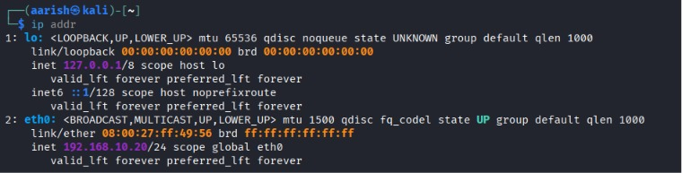

# VirtualBox Static IP Networking Lab

## Objective
Set up two Linux virtual machines (Kali Linux and a second host) on the same
VirtualBox network, assign static IP addresses, and verify bidirectional
connectivity using `ping`.

## Lab Topology

| VM   | Hostname | Interface | IP Address     | MAC Address        |
|------|----------|-----------|-----------------|---------------------|
| VM1  | kali     | eth0      | 192.168.10.10/24 | 08:00:27:ff:49:56 |
| VM2  | aarish   | eth0      | 192.168.10.20/24 | 08:00:27:a2:5b:ba |

Both VMs are attached to the same VirtualBox **Internal Network** named
`labnet`, so they can reach each other directly without going through the
host's external network or the internet.

## Adapter Configuration

In VirtualBox, each VM's **Settings → Network** adapter was configured as
follows:

| Setting            | Value              |
|---------------------|--------------------|
| Attached to          | Internal Network   |
| Name                 | labnet             |
| Promiscuous Mode     | Deny               |
| Cable Connected      | ✅                 |

Both VMs use the same "Attached to" mode and the same network **Name**
(`labnet`) — this is what puts them on the same private L2 segment and lets
them ping each other.


## Interface Verification (`ip addr`)

**VM1 — kali**
```
$ ip addr
...
2: eth0: <BROADCAST,MULTICAST,UP,LOWER_UP> mtu 1500 ...
    link/ether 08:00:27:ff:49:56 brd ff:ff:ff:ff:ff:ff
    inet 192.168.10.10/24 scope global eth0
```


**VM2 — aarish**
```
$ ip addr
...
2: eth0: <BROADCAST,MULTICAST,UP,LOWER_UP> mtu 1500 ...
    link/ether 08:00:27:a2:5b:ba brd ff:ff:ff:ff:ff:ff
    inet 192.168.10.20/24 scope global eth0
```


## Connectivity Test (`ping`)

**VM1 → VM2**
```
$ ping 192.168.10.20
8 packets transmitted, 8 received, 0% packet loss, time 7463ms
rtt min/avg/max/mdev = 0.767/1.190/3.162/0.755 ms
```


**VM2 → VM1**
```
$ ping 192.168.10.10
9 packets transmitted, 9 received, 0% packet loss, time 8065ms
rtt min/avg/max/mdev = 0.621/1.475/5.727/1.517 ms
```


## Result

Both virtual machines successfully communicated over the private network with
**0% packet loss** in both directions, confirming correct static IP
configuration and a working VirtualBox network adapter setup.

## Skills Demonstrated

- Configuring VirtualBox virtual network adapters
- Assigning and verifying static IP addressing on Linux (`ip addr`)
- Validating Layer 3 connectivity between hosts with `ping`
- Reading and interpreting interface/MAC/IP details from CLI output
- Documenting infrastructure work clearly for a technical audience

